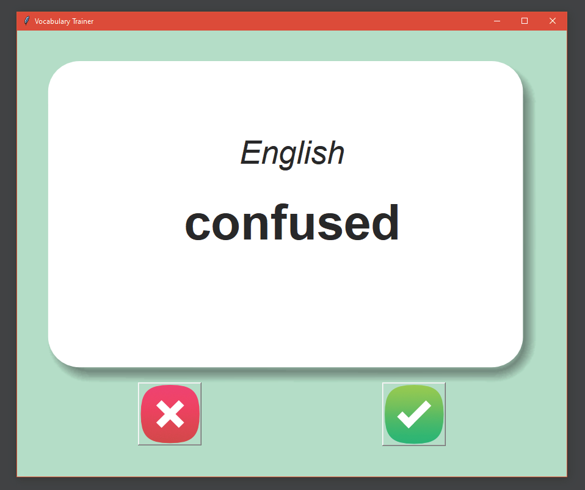
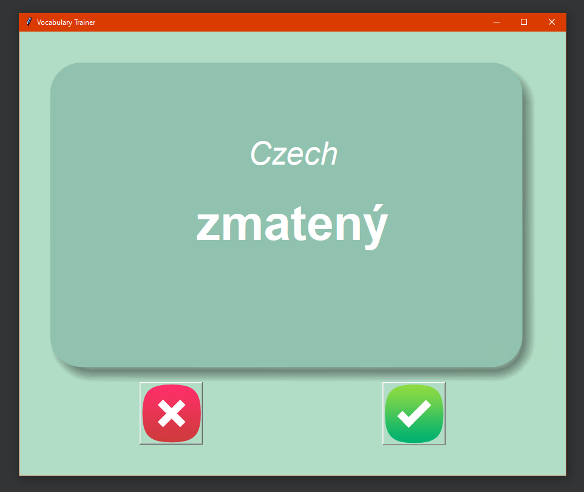

# ❔📘 Vocabulary Trainer 📘❔

---

### Supported languages
* Translation from **English** to **Czech**

---
### Description
* You have only **3 seconds** to guess the translation of 
the given word  
* After 3 seconds the translated word will appear
    * If you knew the translation press the **green check**
    * Else press the **red cross**
    * A new word appears right after confirmation
    
---

### GUI   

#### Guess the translation:

#### Click specific button according to your answer:
